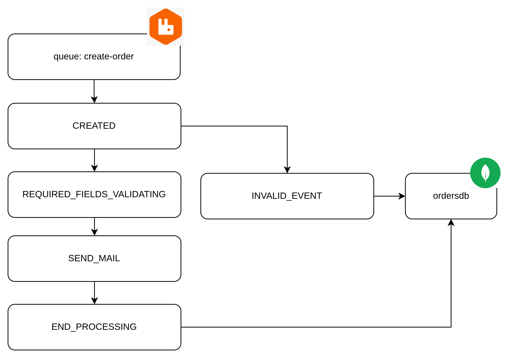

# eeda-orders
Projeto para estudar python para web e uma arquitetura de eventos com




### Sobre o projeto:
- Será utilizado o padrão FIFO (first in first out)

#### payload
```
"{\"orderId\":\"xpto\",\"createdDate\":\"2022-08-23T10:20:00\",\"totalValue\":1568.00,\"products\":{\"id\":\"1\",\"quantity\":1},\"paymentType\":\"PIX\"}"
```
### Importante
#### testar nossa ideia de fila ou tópico no rabbitMQ
```
https://tryrabbitmq.com/
```
 
