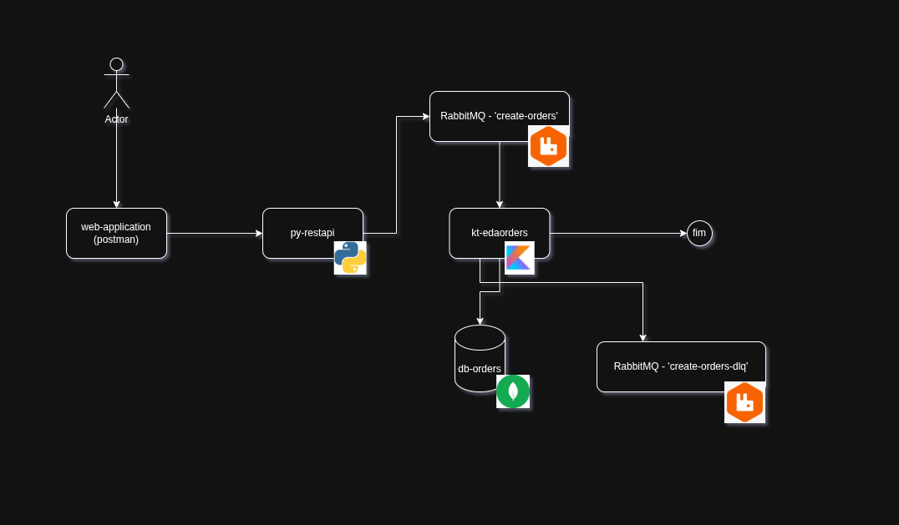

# EDA-Orders

Este repositório contém dois projetos integrados para estudo de arquitetura orientada a eventos utilizando Python e Kotlin, RabbitMQ e MongoDB utilizando alguns padrões de projeto como Strategy.

## Estrutura dos Projetos

- **kt-edaorders**: Serviço backend desenvolvido em Kotlin com Spring Boot, responsável pelo processamento de pedidos e integração com RabbitMQ.
- **py-orders**: API desenvolvida em Python (Flask ou FastAPI), responsável por receber pedidos e enviá-los para a fila de eventos.

## Tecnologias Utilizadas

- **Kotlin + Spring Boot**: Backend robusto para processamento de eventos.
- **Python**: API leve para recebimento e publicação de pedidos.
- **RabbitMQ**: Broker de mensagens para comunicação assíncrona entre serviços.
- **MongoDB**: Banco de dados NoSQL para persistência dos dados dos pedidos.
- **Docker**: Contêineres para facilitar o deploy e integração dos serviços.

## Arquitetura Orientada a Eventos

A arquitetura é baseada em eventos, onde cada pedido gerado pela API Python é publicado em uma fila do RabbitMQ. O serviço Kotlin consome esses eventos, processa os pedidos e persiste os dados no MongoDB. Esse modelo desacopla os serviços, permitindo escalabilidade, resiliência e facilidade de manutenção.




### Fluxo de Processamento

1. **Recepção do Pedido**: A API Python recebe o pedido via HTTP.
2. **Publicação do Evento**: O pedido é publicado em uma fila do RabbitMQ.
3. **Consumo do Evento**: O serviço Kotlin consome o evento, processa o pedido e salva no MongoDB.
4. **Persistência**: Os dados do pedido ficam disponíveis para consulta e análise.

#### Exemplo de Payload
```json
{
  "orderId": "xpto",
  "createdDate": "2022-08-23T10:20:00",
  "totalValue": 1568.00,
  "products": {"id": "1", "quantity": 1},
  "paymentType": "PIX"
}
```

## Como Executar

### Subindo RabbitMQ e MongoDB

```shell
cd docker/
docker compose up -d
```

### Executando py-orders (Python)

```shell
cd py-orders/
docker build -t py-orders .
docker run -d --name py-orders-api --network docker_eda-network -p 8081:8081 py-orders
```

### Executando kt-edaorders (Kotlin)

```shell
cd kt-edaorders/
./gradlew clean build -x test
docker build -t kt-edaorders .
docker run -d --name kt-edaorders --network docker_eda-network -p 8082:8082 kt-edaorders
```

## Observações

- O padrão FIFO (First In First Out) é utilizado para garantir a ordem dos eventos.
- Para testar a fila RabbitMQ, acesse: [https://tryrabbitmq.com/](https://tryrabbitmq.com/)

## Referências

- [Spring Boot + RabbitMQ](https://spring.io/guides/gs/messaging-rabbitmq/)
- [FastAPI](https://fastapi.tiangolo.com/)