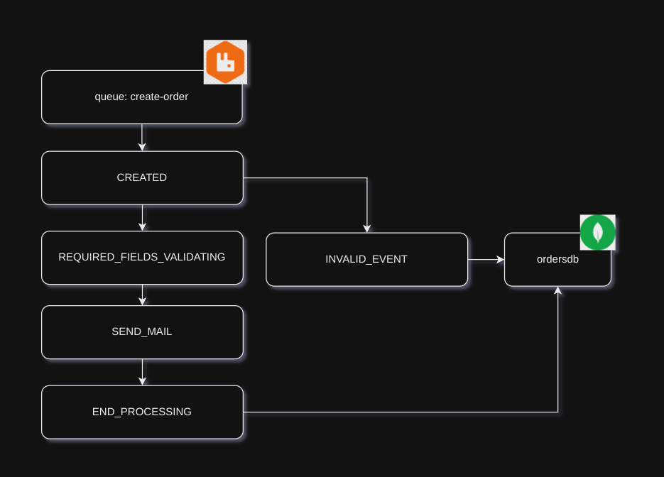

### Buildando o projeto e criando um container docker
```bash
  ./gradlew clean build -x test 
```
```bash
  docker build -t kt-edaorders .
```
```bash
    docker run -d \
    --name kt-edaorders \
    --network docker_eda-network \
    -p 8080:8080 \
    kt-edaorders
```
### Remover container
```bash
    docker rm -f kt-edaorders &&
    docker rmi -f kt-edaorders
```
### Worflow de processamento da aplicação
